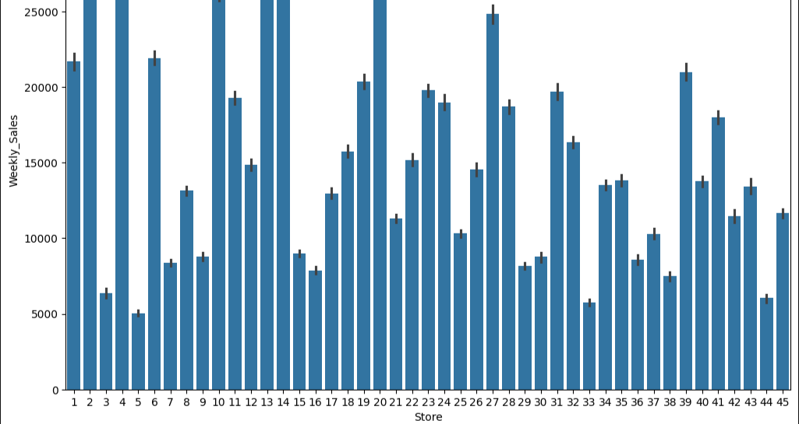
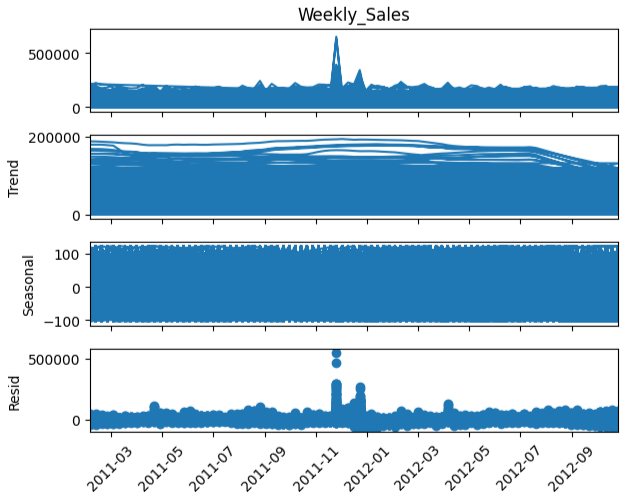

# 🛒 Walmart Sales Forecasting – Task 7

This is my **Task 7 (Sales Forecasting)** from my Machine Learning internship.  
The aim was simple: **predict Walmart’s future sales** based on historical data.  

I had to work with time series data, create new features, and apply regression models to forecast sales.  
This project taught me a lot about how sales data behaves over time — trends, seasonality, random spikes, and the importance of creating the right features.

# 📂 Dataset
I used the **Walmart Sales Forecast** dataset from Kaggle:  https://www.kaggle.com/datasets/aslanahmedov/walmart-sales-forecast/data

The dataset isn’t a single file — it comes with **4 CSV files**:
- `train.csv` → historical weekly sales  
- `test.csv` → test set (for submissions)  
- `features.csv` → extra info (holidays, fuel price, CPI, etc.)  
- `stores.csv` → store-level details
- 
I merged them together so that each row had sales + extra details.

# 🛠 Steps I Followed

# 1. Data Preparation
- Loaded all CSVs with pandas.  
- Merged train, features, and stores on common columns (`Store`, `Date`).  
- Converted `Date` into datetime format for feature engineering.  

# 2. Feature Engineering
Time series models need time-aware features, so I created:
- **Year, Month, Week** → extracted from the `Date` column.  
- **Lag features** → e.g., last week’s sales (`Weekly_Sales.shift(1)`).  
- **Rolling averages** → smoothed sales with a 4-week moving average.  
- Checked seasonality using **seasonal decomposition** (trend + seasonality + noise).  

# 3. Models Used 
- **Linear Regression** → classic regression model to check basic forecasting ability.  
- **XGBoost Regressor** → more advanced, tree-based boosting model that usually performs better on structured/tabular data.
- **LightGBM** → fast gradient boosting model optimized for large datasets.

# 4. Evaluation
- Used **Mean Absolute Error (MAE)** and **Root Mean Squared Error (RMSE)** to check accuracy.  
- Plotted **Actual vs Predicted** sales to visually compare.  

---

# 📈 Results
- **Linear Regression** captured general sales trends but lacked accuracy.  
- **XGBoost** performed better by handling complex sales patterns.  
- **LightGBM** gave the fastest training and highest accuracy overall.

---------------------------------------
| Model             | MAE     | RMSE  |
|-------------------|---------|-------|
| Linear Regression | 1719.61 | 41.47 |
| XGBoost           | 1216.27 | 34.88 |
| LightGBM          | 2935.68 | 54.18 |
---------------------------------------

I also learned that adding lag values and rolling averages really improves forecasting, because sales often depend on past trends.

# 🛠 Tools & Libraries
- **pandas** → data loading, cleaning, merging, feature creation  
- **numpy** → number crunching  
- **matplotlib** → plotting sales trends and model results  
- **scikit-learn** → regression models, error metrics, time-series split  
- **statsmodels** → seasonal decomposition (trend/seasonality)  
- **xgboost** → advanced forecasting model
- **lightgbm** → fast gradient boosting model 

# Visualization

